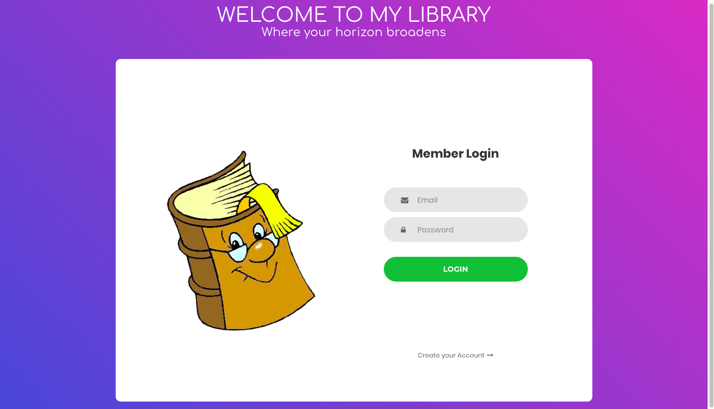

# :book: :book: :book: MyLibrary-React-Project :book: :book: :book:
* **Purpose of the app:** 
   This app was created to help users to organize and keep track of their books libraries in an online and permanent platform.
* **How to use:**
   Users must create a login in order to see his/her dashboard. Guests are not allowed to create a library. After signing up, the user has the option to add a book entering book title, author, published date and book image url. After adding the book, user can see it on his/her dashboard. Moreover, after creating a book info card, user will be given options to edit and to delete the book. There are 4 different genre categories for the books which the app is automatically categorized them. In user authentication, validation in log in and register process is provided.
* **Features on the app:**
    User is able to add, edit and delete the books. There are certain categories where user can find the book by its genre. In addition, in the search bar, user is able to make a search by the book title.  

## Site Preview

   
## Live link: 
- ["MY LIBRARY APP"](http://beap.surge.sh/)

## Introduction video of the project: 
- https://youtu.be/Iq2LGrzpNpQ

## Database: 
PostgreSQL

## Featured programs: 
This project was built using React.js, Redux.js, JavaScript, Node.js, Express.js, HTML and CSS.

    
